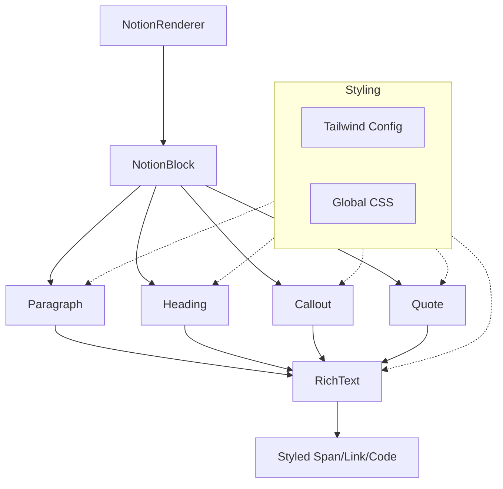

# Notion-like 디자인 개편 분석 보고서

## 1. 현재 구현 분석 및 한계점

### 1.1 스타일링 시스템 (`tailwind.config.mjs`, `global.css`)
- **현황**: `global.css`에 Notion 컬러 팔레트가 변수로 정의되어 있으나, Tailwind config의 `extend`에는 반영되어 있지 않음.
- **한계점**:
    - `notion-text-gray`와 같은 커스텀 클래스를 수동으로 사용 중이며, Tailwind의 유틸리티 클래스 생태계(hover, focus, dark mode 등)를 100% 활용하지 못함.
    - 폰트 시스템이 `Inter`로 고정되어 있으며, Notion 특유의 자간(letter-spacing)과 행간(line-height) 세부 설정이 부족함.
    - 라이트/다크 모드 전환 로직이 CSS 변수에 의존하고 있어, 컴포넌트 레벨에서의 Tailwind 다크모드(`dark:`) 제어가 제한적임.

### 1.2 블록 컴포넌트 (`src/components/Glaze/blocks/`)
- **현황**: 기본적인 블록(Paragraph, Heading, Callout, Quote 등)이 구현되어 있으나, 디자인이 'Generic Blog' 스타일과 'Notion' 스타일이 혼재되어 있음.
- **한계점**:
    - **Callout/Quote**: 둥근 모서리(`rounded-2xl`)와 넓은 패딩(`p-6`)이 Notion의 절제된 디자인(작은 radius, 적절한 여백)과 대조됨.
    - **Heading**: Notion은 제목 위에 넓은 여백을 두지만, 현재 설정은 하단 여백도 상당히 커서 블록 간의 응집도가 떨어짐.
    - **Code**: `bg-slate-900` 등 어두운 테마가 고정되어 있어, Notion의 세련된 인라인/블록 코드 스타일과 차이가 있음.
    - **Spacing**: `NotionRenderer`에서 `space-y-5`를 일괄 적용하고 있어, 블록의 종류에 상관없이 동일한 간격이 발생함. (Notion은 블록 타입에 따라 간격이 유동적임)

---

## 2. 'Notion-like' 디자인 구현 기술 명세

### 2.1 기초 스타일 재정의 (Foundations)
- **Typography**: 
    - Font: `Inter`, `-apple-system`, `BlinkMacSystemFont`, `Segoe UI`, `Roboto` 순으로 시스템 폰트 활용.
    - Metrics: `line-height: 1.5`, `letter-spacing: -0.005em`.
- **Color Palette**: 
    - `tailwind.config.mjs`에 `notion` 컬러 그룹 추가.
    - 배경색과 텍스트색을 Notion 공식 가이드라인에 맞춰 정밀 조정 (현재 `global.css` 변수 고도화).
- **Layout**: 
    - 컨텐츠 폭: 기본 `720px` (Full width 옵션 대응 가능하도록 설계).

### 2.2 블록별 특유 스타일 적용
| 블록 타입 | 주요 변경 사항 | 기술적 구현 |
| :--- | :--- | :--- |
| **Heading** | 폰트 크기 축소 및 상단 여백 강화 | `mt-[1.5em] mb-[3px]`, `font-semibold` |
| **Callout** | 아이콘 여백 및 배경색 정밀화 | `p-4`, `bg-opacity-10`, `rounded-[3px]` |
| **Quote** | 왼쪽 보더 두께 및 색상 조정 | `border-l-3`, `pl-4`, `py-1`, `italic` 제거(선택) |
| **Code** | 라이트 모드 배경색(`rgb(247, 246, 243)`), 다크 모드 배경색 조정 | 테마별 색상 분리 및 패딩 최적화 |
| **List** | 중첩 리스트 간격 및 마커 스타일 | `pl-[1.5em]`, `space-y-[2px]` |

---

## 3. 개편 전략 및 우선순위

### 1순위: 인프라 정비 (High Impact)
1. [`tailwind.config.mjs`](tailwind.config.mjs): Notion 컬러 팔레트 및 폰트 설정 내재화.
2. [`src/styles/global.css`](src/styles/global.css): 전역 폰트 및 리셋 스타일 최적화.

### 2순위: 핵심 렌더링 로직 수정 (Medium Impact)
1. [`src/components/Glaze/NotionRenderer.astro`](src/components/Glaze/NotionRenderer.astro): 일괄적인 `space-y-5` 제거 및 블록 간 간격 제어 로직 개선.
2. [`src/components/Glaze/RichText.astro`](src/components/Glaze/RichText.astro): 인라인 코드 및 링크 스타일 정밀화.

### 3순위: 블록 컴포넌트 전면 개편 (Visual Overhaul)
1. [`src/components/Glaze/blocks/Heading.astro`](src/components/Glaze/blocks/Heading.astro)
2. [`src/components/Glaze/blocks/Paragraph.astro`](src/components/Glaze/blocks/Paragraph.astro)
3. [`src/components/Glaze/blocks/Callout.astro`](src/components/Glaze/blocks/Callout.astro)
4. [`src/components/Glaze/blocks/Quote.astro`](src/components/Glaze/blocks/Quote.astro)
5. [`src/components/Glaze/blocks/Code.astro`](src/components/Glaze/blocks/Code.astro)

---

## 4. Mermaid 다이어그램 (렌더링 구조)

