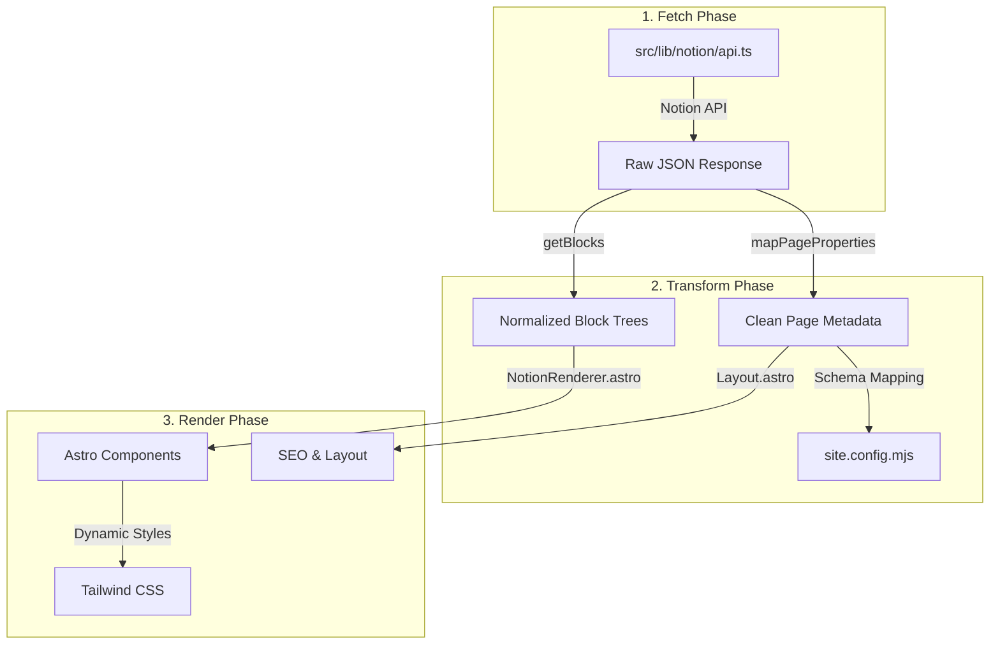

# Notion 데이터 동적 렌더링 최적화 분석 및 설계 보고서

본 보고서는 현재 프로젝트의 Notion 데이터 연동 방식에서 하드코딩된 요소를 식별하고, Astro의 기능을 최대한 활용하여 동적이고 효율적인 렌더링 시스템을 구축하기 위한 설계안을 제시합니다.

## 1. 현재 하드코딩 및 개선 필요 사항 목록

### A. 페이지 레이아웃 및 텍스트 하드코딩
- **`src/pages/blog.astro`**: 
    - "Insight Archive", "Read Article" 등의 UI 텍스트가 코드 내에 직접 입력되어 있음.
    - 게시글 설명이 "클릭하여 내용을 확인하세요."로 고정됨.
- **`src/pages/index.astro`**:
    - "블로그 탐색하기", "Recent Stories" 등의 버튼 및 섹션 타이틀 하드코딩.

### B. 데이터 변환 및 매핑 (Transform)
- **`src/lib/notion/transform.ts`**:
    - `Title`, `Name`, `Slug`, `Tags`, `Date`, `Description` 등 특정 속성 이름이 하드코딩되어 있어, Notion 데이터베이스 구조 변경 시 유연한 대처가 어려움.
    - 특히 `p.Title`과 `p.Name`을 혼용하는 방식은 일관성이 부족함.

### C. 컴포넌트 렌더링 (Renderer)
- **`src/components/Glaze/NotionRenderer.astro`**:
    - 지원하는 블록 타입(`paragraph`, `heading_1` 등)이 제한적이며, 각 블록의 스타일과 HTML 구조가 렌더러 내부에 고정됨.
    - 중첩된 블록(children) 처리가 구현되어 있으나, 렌더링 루프에서 이를 충분히 활용하지 못할 가능성이 있음.
    - 텍스트 스타일링(Bold, Italic, Link 등)에 대한 세부 처리가 미흡함 (`plain_text`만 join하여 사용 중).

### D. 데이터 흐름 및 성능
- **`src/pages/post/[slug].astro`**:
    - 관련 글(Related Posts)을 가져오기 위해 모든 페이지 데이터를 다시 Fetch함. 이는 빌드 성능을 저하시킬 수 있음.
    - 목차(TOC) 추출 로직이 페이지 컴포넌트 내에 위치하여 재사용성이 떨어짐.

---

## 2. 개선된 데이터 흐름 (Fetch -> Transform -> Render)

---

## 3. Astro 기능을 활용한 최적화 전략

1. **`getStaticPaths` 최적화**:
   - 빌드 시점에 Notion 데이터를 한 번만 가져와 모든 페이지에 props로 전달하여 데이터 중복 Fetch 방지.
2. **Schema-less Config**:
   - `site.config.mjs`를 도입하여 Notion 데이터베이스의 속성 이름(예: 'Status', 'Published Date' 등)을 외부 설정으로 분리.
3. **Recursive Component Rendering**:
   - `NotionRenderer`가 각 블록 타입을 개별 Astro 컴포넌트로 분리하고, 중첩된 블록을 재귀적으로 처리하도록 개선.
4. **Partial Hydration (필요 시)**:
   - 검색 위젯이나 필터링 버튼 등 인터랙션이 필요한 부분만 클라이언트 사이드 JS 사용 (현재 `SearchWidget.jsx` 활용 중).
5. **Image Optimization**:
   - Notion 외부 이미지 URL을 Astro의 `<Image />` 컴포넌트와 결합하여 최적화된 WebP/Avif 생성.

---

## 4. 변경 대상 파일 및 수정 방향

### 1) `src/lib/notion/transform.ts` & `site.config.mjs`
- **수정 방향**: Notion 속성 매핑을 설정 파일에서 읽어오도록 변경.
- **내용**: `page.properties[CONFIG.notion.props.title]` 형식으로 접근.

### 2) `src/components/Glaze/NotionRenderer.astro`
- **수정 방향**: 블록별 개별 컴포넌트화 및 리치 텍스트 렌더링 강화.
- **내용**: `Paragraph.astro`, `Heading.astro`, `Code.astro` 등으로 분리. `annotations`(bold, italic 등) 처리 로직 추가.

### 3) `src/pages/blog.astro` & `index.astro`
- **수정 방향**: 하드코딩된 UI 텍스트를 `site.config.mjs` 혹은 Notion 데이터베이스 메타데이터에서 가져오도록 변경.
- **내용**: `database.description` 등을 활용하여 동적 사이트 설명 구현.

### 4) `src/lib/notion/api.ts`
- **수정 방향**: 데이터 캐싱 및 관련 글 추출 로직 효율화.
- **내용**: 메모리 캐싱을 통해 동일 빌드 프로세스 내 중복 호출 방지.

---

**이 계획에 대해 어떻게 생각하시나요? 추가로 고려해야 할 사항이나 수정하고 싶은 부분이 있다면 말씀해 주세요.**
